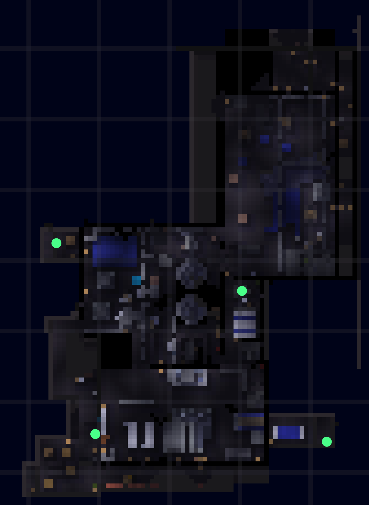
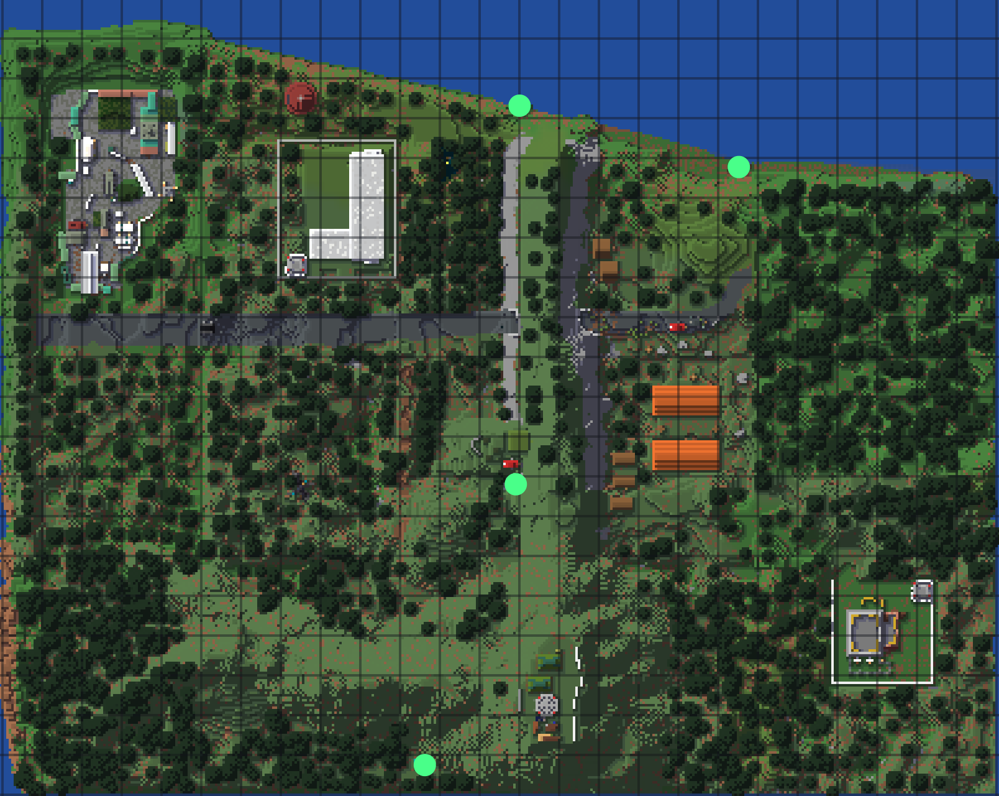

# マップ一覧

<table data-full-width="false"><thead><tr><th>色</th><th>印の意味</th></tr></thead><tbody><tr><td>緑</td><td>脱出ポイント</td></tr></tbody></table>

## ファクトリー

<figure><figcaption></figcaption></figure>

## 市街地(City of IEM)

<figure><figcaption></figcaption></figure>

## Forest

<figure><figcaption></figcaption></figure>
